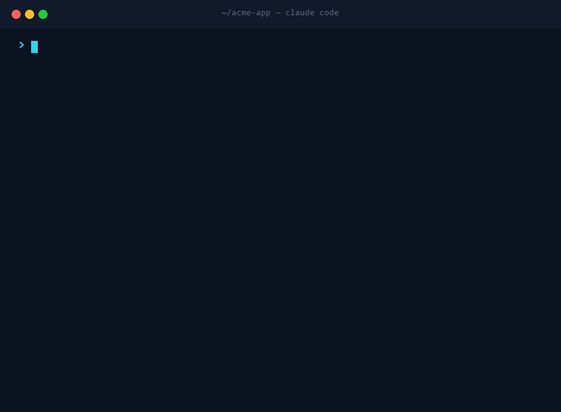

<h1 align="center">👁️ Argus</h1>
<p align="center"><strong>The all-seeing, multi-agent, vision-verified auditor for Claude Code.</strong></p>
<p align="center">
  <a href="#install">Install</a> ·
  <a href="#usage">Usage</a> ·
  <a href="#what-makes-it-different">Why</a> ·
  <a href="#how-it-works">How</a>
</p>
<p align="center">
  
  
  
  
</p>

> *In myth, Argus Panoptes was the giant with a hundred eyes who saw everything and never fully
> slept.* This is that, for your software: **many parallel agents that test every single control
> for real — screenshotting before/after and *looking* at the result** — adversarially verify each
> finding, and hand you a ranked, location-referenced fix list. Then `/overnight` keeps watch:
> audit → fix → verify → commit, while you sleep.

<p align="center">
  
</p>

## Why this exists

Most reviews check whether a feature *exists*. They miss the bug that actually burns users: the
toggle that renders but never saves, the field that saves but never syncs to the other screen, the
"Sync failed" that hides the real error. **Argus checks whether every control actually works — by
exercising it and looking at the screen** — so you stop being the QA for your own product.

It's a *method*, distilled into a skill, so it works on **any** project — not just the one it was born on.

## What makes it different

- **Ground truth, seen with vision.** Screenshot before/after every interaction and confirm the
  *visible* result — `adb` for Android, **Playwright MCP** for the web, run the binary for CLIs.
  "Renders" ≠ "works"; "saves" ≠ "syncs".
- **One agent per surface, every control.** Exhaustive and parallel — no button skipped.
- **Fresh-eyes customer personas** with *zero* project memory ("you're a first-timer, here's your
  goal") surface what's missing or confusing — plus a competitive teardown of rivals.
- **Adversarial verification.** Every finding gets a skeptic who tries to *refute* it; only
  confirmed defects survive. That kills false positives.
- **Skill-aware.** It discovers your *other* installed design skills and routes UI findings through
  them — so it polishes, not just reports.
- **Universal.** `android-app-code` · `running-app` · `website` · `cli` · `api` · `mcp-server` · any `code`.

## The lenses (run all, or scope them)

`functional-persistence` · **`trust-audit`** (does the UI lie?) · `cross-surface-sync` ·
`ui-interaction-craft` · `motion` · `accessibility` · `performance` · `security-privacy` ·
`microcopy-tone` · `empty-and-error-states` · `edge-cases` · `design-token-consistency` ·
`onboarding-first-run` · `delight` · `fresh-eyes-customer-journeys` · `competitive-gaps`.

## Install

**Option A — plugin marketplace (one line):**
```
/plugin marketplace add Evil-Bane/argus
/plugin install argus
```

**Option B — copy the skills:**
```bash
git clone https://github.com/Evil-Bane/argus
cp -r argus/skills/* ~/.claude/skills/
```
Restart Claude Code; `/customer-audit` and `/overnight` are now available.

## Usage

```
/customer-audit                   # full audit of the current project
/customer-audit ui                # craft + motion + a11y + tokens + delight
/customer-audit customer          # fresh-eyes personas + competitive teardown
/customer-audit https://your.app  # audit a live website via Playwright MCP
/customer-audit fix               # run, then auto-apply the confirmed fixes
/customer-audit redesign Settings # tournament: N design variants → judge → ship the winner
/overnight  make this production-ready    # autonomous audit→fix→verify→commit loop
```

## How it works

`skills/customer-audit/engine.workflow.js` is a run-ready, parameterized workflow: **Phase 1** fans
out one agent per surface (each exercising every control + screenshotting) plus persona and
competitive agents; **Phase 2** adversarially verifies each finding; **Phase 3** dedupes, ranks
(P0–P3 with file:line / URL+selector), and emits a fix order. `/overnight` calls it in a loop with a
durable journal so nothing is ever lost, and self-schedules its wake-ups.

Two skills ship in this plugin:
- **`/customer-audit`** — the auditor.
- **`/overnight`** — the autonomous loop that runs the auditor and fixes what it finds.

## Validate it yourself

No hand-waving — reproduce the claims in a couple of minutes:

1. Install (above), then open Claude Code in any project (a small web app or repo works best).
2. Run `/customer-audit ui`.
3. Watch it fan out one agent per surface, exercise + screenshot each control, run an adversarial
   verify pass, then print a ranked P0–P3 list with `file:line` references.

For the autonomous loop, try `/overnight  fix the top 3 issues you find, build, and commit each` —
it keeps a durable journal and self-schedules wake-ups, so a crash or pause never loses progress.

What to check: every finding cites a concrete location; refuted findings are dropped before they
reach you; UI findings are routed through any design skills you already have installed.

## Contributing

Issues and PRs welcome — new lenses, new target types (desktop, game engines), and better exercise
playbooks especially. Keep findings concrete and verifiable.

## License

MIT © 2026 [Evil-Bane](https://github.com/Evil-Bane)
